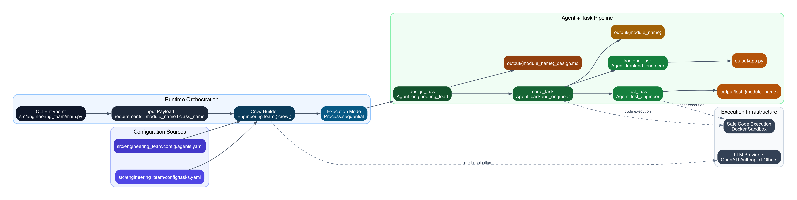

# Engineering Team

A multi-agent code generation workflow built with [CrewAI](https://github.com/crewAIInc/crewAI).  
This project takes high-level product requirements and produces:

- a backend Python module,
- a simple Gradio demo UI,
- and unit tests,

using a sequential team of specialized agents.

## Overview

The workflow is designed to simulate an engineering team:

- **Engineering Lead**: creates a detailed design from requirements.
- **Backend Engineer**: implements the Python backend module.
- **Frontend Engineer**: builds a minimal Gradio UI that uses the backend.
- **Test Engineer**: writes unit tests for the backend.

Artifacts are written to the `output/` directory.

## How It Works

Execution starts in `src/engineering_team/main.py`, which passes input variables (requirements, module name, class name) to the Crew:

1. `design_task` -> writes `output/{module_name}_design.md`
2. `code_task` -> writes `output/{module_name}`
3. `frontend_task` -> writes `output/app.py`
4. `test_task` -> writes `output/test_{module_name}`

Task and agent behavior is configured in:

- `src/engineering_team/config/agents.yaml`
- `src/engineering_team/config/tasks.yaml`

## Architecture Diagram



```mermaid
flowchart TB
    classDef entry fill:#0f172a,color:#f8fafc,stroke:#1e293b,stroke-width:1.5px;
    classDef orchestrator fill:#0b3b5a,color:#eff6ff,stroke:#075985,stroke-width:1.5px;
    classDef task fill:#14532d,color:#f0fdf4,stroke:#166534,stroke-width:1.5px;
    classDef output fill:#78350f,color:#fffbeb,stroke:#92400e,stroke-width:1.5px;
    classDef config fill:#312e81,color:#eef2ff,stroke:#3730a3,stroke-width:1.5px;
    classDef infra fill:#334155,color:#f8fafc,stroke:#475569,stroke-width:1.5px,stroke-dasharray: 4 3;

    subgraph Runtime["Runtime Orchestration"]
        A["CLI Entrypoint<br/>`src/engineering_team/main.py`"]:::entry
        B["Input Payload<br/>`requirements`, `module_name`, `class_name`"]:::entry
        C["Crew Builder<br/>`EngineeringTeam().crew()`"]:::orchestrator
        D["Execution Mode<br/>`Process.sequential`"]:::orchestrator
        A --> B --> C --> D
    end

    subgraph Pipeline["Agent + Task Pipeline"]
        T1["`design_task`<br/>Agent: `engineering_lead`"]:::task
        T2["`code_task`<br/>Agent: `backend_engineer`"]:::task
        T3["`frontend_task`<br/>Agent: `frontend_engineer`"]:::task
        T4["`test_task`<br/>Agent: `test_engineer`"]:::task

        O1["`output/{module_name}_design.md`"]:::output
        O2["`output/{module_name}`"]:::output
        O3["`output/app.py`"]:::output
        O4["`output/test_{module_name}`"]:::output

        D --> T1
        T1 --> O1
        T1 --> T2
        T2 --> O2
        T2 --> T3
        T2 --> T4
        T3 --> O3
        T4 --> O4
    end

    subgraph Configuration["Configuration Sources"]
        CfgA["`src/engineering_team/config/agents.yaml`"]:::config
        CfgT["`src/engineering_team/config/tasks.yaml`"]:::config
        CfgA --> C
        CfgT --> C
    end

    subgraph Infrastructure["Execution Infrastructure"]
        I1["LLM Providers<br/>OpenAI, Anthropic, others"]:::infra
        I2["Safe Code Execution<br/>Docker sandbox"]:::infra
    end

    C -. model selection .-> I1
    T2 -. safe code execution .-> I2
    T4 -. safe code execution .-> I2
```

## Repository Structure

```text
.
├── src/engineering_team/
│   ├── main.py                 # Entry point
│   ├── crew.py                 # Crew and task wiring
│   ├── config/
│   │   ├── agents.yaml         # Agent prompts, roles, models
│   │   └── tasks.yaml          # Task definitions and output files
│   └── tools/
│       └── custom_tool.py      # Optional custom CrewAI tool scaffold
├── knowledge/
├── output/                     # Generated artifacts (created at runtime)
├── example_output_*            # Sample generated outputs
└── pyproject.toml
```

## Prerequisites

- Python `>=3.10,<3.13`
- Docker (recommended/required when using CrewAI safe code execution mode)
- API keys for the LLM providers referenced in `agents.yaml`

Typical environment variables:

- `OPENAI_API_KEY`
- `ANTHROPIC_API_KEY`

## Installation

### Option 1: Using `uv` (recommended)

```bash
uv sync
```

### Option 2: Using `pip`

```bash
python3 -m venv .venv
source .venv/bin/activate
pip install -e .
```

## Usage

Run the crew:

```bash
uv run engineering_team
```

Alternative:

```bash
python3 -m engineering_team.main
```

After a run, check generated files in `output/`.

## Configuration

### Update the product brief

Edit the values in `src/engineering_team/main.py`:

- `requirements`
- `module_name`
- `class_name`

### Change model/provider behavior

Edit `src/engineering_team/config/agents.yaml` to update:

- agent goals and prompts,
- LLM providers/models per agent.

### Change task flow/output locations

Edit `src/engineering_team/config/tasks.yaml` to update:

- task descriptions,
- context dependencies,
- output file paths.

## Notes

- `output/` is created automatically if missing.
- Example generated outputs are included under `example_output_4o/`, `example_output_new/`, and `example_output_mini/`.
- Only the `run` entry point is implemented in `main.py`.

## Troubleshooting

- **`ModuleNotFoundError: crewai`**
  - Ensure dependencies are installed (`uv sync` or `pip install -e .`).
- **Provider authentication errors**
  - Confirm required API keys are exported in your shell/session.
- **Code execution issues in safe mode**
  - Verify Docker is installed and running.

## License

Add your project license information here.
